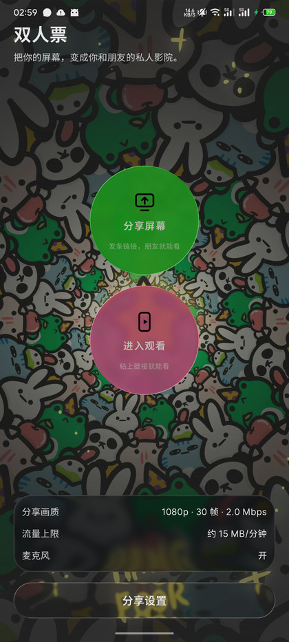
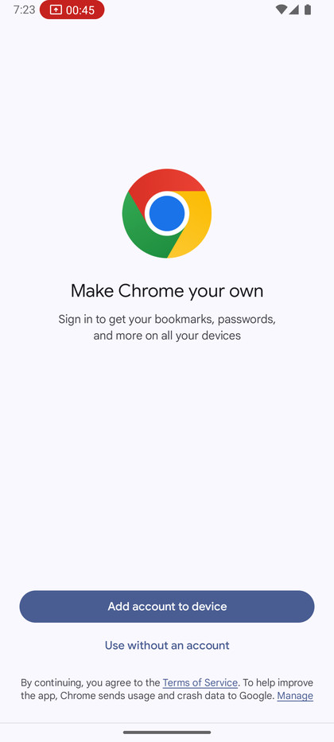
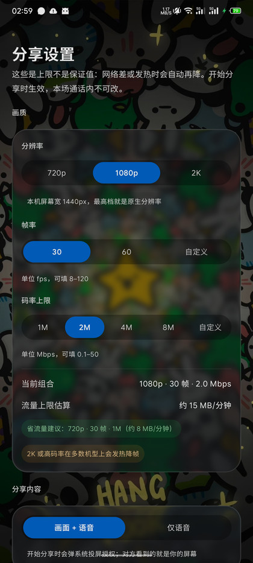
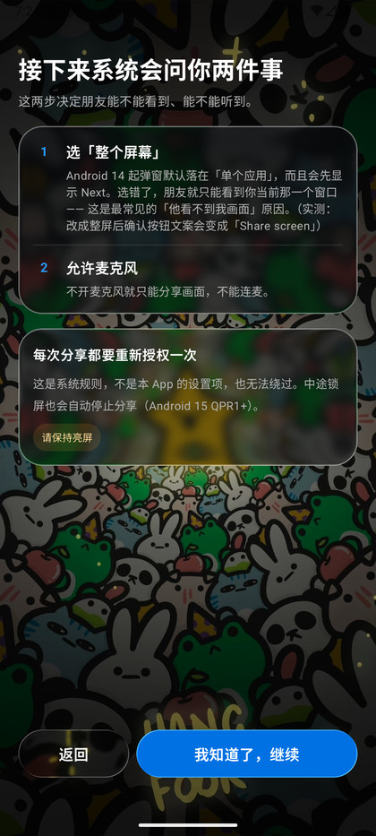
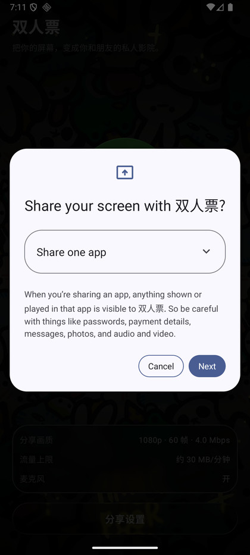
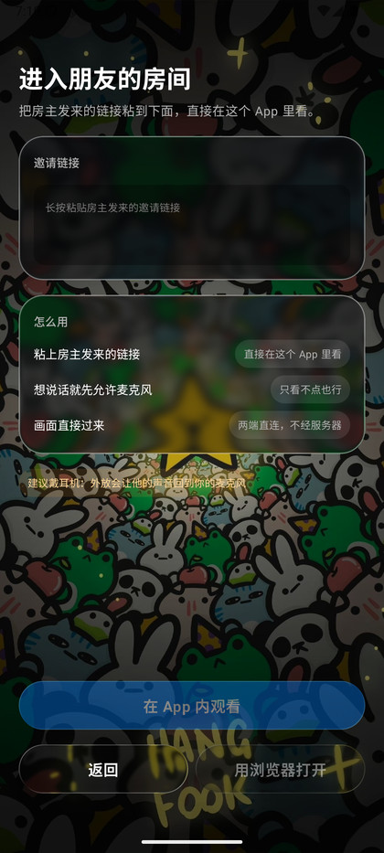
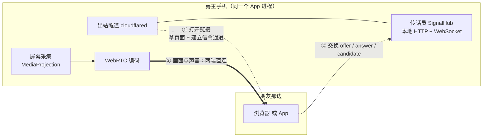

# 双人票 · TicketForTwo

> 把你的屏幕，变成你和朋友的私人影院。

[](https://developer.android.com)
[](https://kotlinlang.org)
[](https://webrtc.org)
[](../../releases)

一个 Android 屏幕分享 App：**点一下开始分享 → 把链接发给朋友 → 他点开就能看**。

不用注册、不用加好友、不用连同一个 Wi-Fi，也**不需要自己架服务器** ——
画面和声音在你们两台设备之间**直连**，不经过任何中转。

---

## 截图

| 首页 | 邀请链接 | 分享设置 |
| :---: | :---: | :---: |
|  |  |  |
| 两个入口，一屏搞定 | 发这一条链接就够了 | 分辨率 / 帧率 / 码率 |

| 授权指引 | 系统投屏对话框 | 观众粘贴链接 |
| :---: | :---: | :---: |
|  |  |  |
| 开始前先讲清要发生什么 | **这一步必须选「整个屏幕」** | 观众端：App 内看，或直接用浏览器 |

---

## 核心特性

- **一条链接走完全程**。房主只做一件事：把链接发出去。之后 offer / answer / 候选地址全自动交换，
  房主不用再粘贴任何东西回来。
- **观众零门槛**。朋友可以**直接用浏览器打开**（不用装 App、不用注册），也可以装同一款 App
  在 App 内观看。
- **画面不经服务器**。媒体走 WebRTC 端到端直连；服务器只被用来"告诉对方往哪儿连"，
  而且那台"服务器"其实就是**房主手机自己**。
- **短链接**。链接形如 `https://xxx-yyy-zzz.trycloudflare.com/?k=XXXXXXXXX`，
  在微信里不会像超长链接那样被折叠截断。
- **液态玻璃 UI**。整套界面基于 [Kyant0/AndroidLiquidGlass](https://github.com/Kyant0/AndroidLiquidGlass)
  的 `backdrop` 库：磨砂、折射、色差、高光都是真实渲染，不是贴图。
- **内置调参工具**（仅调试包）。颜色实验室 + 玻璃参数实验室 + 自定义壁纸，
  在 App 里调好 → 复制参数 → 写回代码。

---

## 它是怎么工作的



三个阶段，缺一不可：

1. **给手机要一个临时门牌号**。手机在运营商网络后面拿不到公网地址，所以 App 内打包了一个
   `cloudflared`，用 Cloudflare 的免费 Quick Tunnel 建一条**出站隧道**，拿到一个临时域名。
   它只承载"页面 + 信令"这点文本流量。
2. **传话员**。房主进程里跑着一个本地 HTTP + WebSocket 服务（`SignalHub`，手写的 RFC 6455 最小实现）。
   观众的 WebSocket 请求经隧道进来，双方就在这里交换 offer / answer / ICE 候选。
3. **画面走直连**。连接一旦谈成，音视频就走 WebRTC 的 P2P 通道了 —— **在隧道之外**，
   两端之间直接传，不经 Cloudflare，也不经任何第三方。

> 一句话：**隧道负责"怎么找到你"，WebRTC 负责"怎么把画面给你"。**

---

## 使用流程

### 分享端（你）

1. 打开 App，点 **分享屏幕**。
2. 看一眼授权指引 → 继续。
3. 系统弹出投屏确认 → **务必把「共享单个应用」改成「共享整个屏幕」**（见下方说明）。
4. 允许麦克风（不想连麦可以拒绝，仍然可以只分享画面）。
5. 等几秒到几十秒，出现邀请链接 → 点 **复制邀请** → 发给你朋友。

分享期间会有一条常驻通知，**请不要锁屏**（Android 15 QPR1+ 锁屏会自动停止投屏）。

### 观看端（朋友）

- **最省事**：直接用浏览器打开链接。页面会自己完成协商并把画面接上；
  若浏览器拦截自动播放，页面上点一下即可。
- **App 内观看**：打开同一款 App → 点 **进入观看** → 粘贴链接。

### 为什么必须选「整个屏幕」

Android 14 起的投屏对话框默认落在**「共享单个应用」**。选错了，朋友看到的是**你当前那一个窗口**，
而不是整块屏幕 —— 这是"他看不到我画面"最常见的原因。
改成「共享整个屏幕」后，确认按钮的文案会从 `Next` 变成 `Share screen`。

---

## 画质设置

| 项 | 可选 |
| --- | --- |
| 分辨率 | 按**本机屏幕宽度**自动标注：1080 宽机型是 540p / 720p / 1080p；1440 宽（2K）机型是 720p / 1080p / **2K** |
| 帧率 | 30 / 60，或自定义（8–120 fps） |
| 码率上限 | 1 / 2 / 4 / 8 Mbps，或自定义（0.1–50 Mbps） |
| 内容 | 画面 + 语音 / 仅语音 |

- 分辨率**只能缩不能放**，所以档位按屏幕实际宽度算，最高档就是原生分辨率；
  也因此这一项**不提供自定义**（可选范围天然被屏幕卡死）。
- 这些是**上限不是保证值**：网络差或机身发热时会自动再降。
- 改动会**立即保存**，但画质档位是在**开始分享那一刻**读取的，本场通话内不会再变
  （一期没有信令通道去重新协商，就不假装能改）。

---

## 构建

### 环境

- JDK 17+（AGP 9 内置 Kotlin 支持，不需要单独的 Kotlin 插件）
- Android SDK：`compileSdk 37` / `targetSdk 36` / `minSdk 33`
- 不需要 NDK —— `libwebrtc` 用预编译版，`cloudflared` 的 Android 二进制已随仓库提供

### 命令

```bash
# 调试包：含玻璃/颜色实验室，包含 arm64 + x86_64（模拟器可直接跑通整条分享链路）
./gradlew assembleDebug      # → app/build/outputs/apk/debug/app-debug.apk

# 正式包：不含实验室，只含 arm64
./gradlew assembleRelease    # → app/build/outputs/apk/release/app-release.apk
```

### 正式版签名

正式包需要一把自己的签名密钥（Android 靠它认定"这是同一个 App"）。
密钥路径与密码从 `local.properties` 读取，**不进仓库**：

```properties
t2.storeFile=/绝对路径/your-release.jks
t2.storePassword=******
t2.keyAlias=your-alias
t2.keyPassword=******
```

- 没配这几项的机器**也能正常构建**，只是打出来的 release 包不带签名。
- ⚠️ **这把密钥一旦丢失，就再也无法更新这个 App**（只能换包名重新发布，老用户必须卸载重装）。
  请把 `.jks` 和密码异地备份。

---

## 技术要点

- **媒体**：`libwebrtc`（`io.github.webrtc-sdk:android`），`sendrecv` 双向音频，
  trickle ICE；STUN 优先用国内可达的三个（芒果TV / B站 / 小米），Google 兜底。
- **信令**：`SignalHub` —— 房主进程内的 HTTP + WebSocket 服务，手写 RFC 6455
  （握手 / 掩码解码 / ping-pong / 分片 / close）。房主自己在同进程内走内存通道，不走 socket。
  链接里带一个随机接入凭证（`?k=`），防止陌生人白看。
- **观众客户端**：`WsClient` —— 同样手写的最小 WebSocket 客户端（TCP + TLS/SNI、出口帧掩码、
  分片重组），让观众不必依赖浏览器。
- **隧道**：`cloudflared` 作为可执行文件按 native 库的方式打包进 `jniLibs`，
  靠 `useLegacyPackaging = true` 解压到磁盘后才能执行（Android 10+ 禁止从可写目录执行文件）。
  *（本项目用的这份二进制带 DNS 补丁，原因见 `docs/cloudflared-android-patch.md`）*
- **UI**：Jetpack Compose + `backdrop` 库的真实折射/磨砂。整套页面挂在一个 backdrop 采样宿主上，
  玻璃元素留在宿主之外 —— 否则会形成 RenderNode 自引用。

---

## 已知限制

- **同时只支持一个观众**：新的连接会顶掉前一个。
- **每次分享都要重新授权投屏**：这是系统规则，无法绕过；分享中锁屏也会自动停止。
- **分享端必须装 App**，只有观看端可以纯浏览器。
- **隧道地址每次分享都变**：用的是 Cloudflare Quick Tunnel（免费、无需账号，代价是不保证固定域名）。
- **建链需要几秒到几十秒**：隧道注册本身通常几秒，慢的时候可能到 30 秒；界面上给的是进度而不是转圈。
- **依赖 Cloudflare 可达**：手机必须能连到 Cloudflare 边缘（用于建立隧道），媒体不受此影响。

---

## 项目结构

```
app/src/main/java/com/ticketfortwo/app/
├── MainActivity.kt            路由（AnimatedContent 转场）
├── CallSession.kt             分享端状态机：Preparing → WaitingViewer → Connecting → Connected
├── ViewerSession.kt           观看端状态机
├── ShareQuality.kt            画质档位与持久化（真源）
├── ShareService.kt            投屏期间的前台服务
├── capture/                   屏幕采集
├── rtc/                       WebRTC 封装（Peer / RtcEngine）
├── signaling/                 SignalHub（服务端）+ WsClient（客户端）
├── tunnel/                    cloudflared 进程管理与地址抓取
└── ui/
    ├── app/                   各屏（Screens / ViewerScreens / Kit / Ambient / Labs）
    ├── glass/                 玻璃组件
    └── theme/                 设计令牌
app/src/main/assets/viewer/    观众端网页（浏览器直接打开的那个）
app/src/main/jniLibs/          cloudflared 可执行文件（arm64-v8a / x86_64）
docs/                          设计文档、效果图、截图
scripts/                       开发期脚本（含玻璃量化测量等）
```

## 更多文档

- [`docs/PLAN.md`](docs/PLAN.md) —— 方案与决策记录
- [`docs/PIIK-ANALYSIS.md`](docs/PIIK-ANALYSIS.md) —— 同类产品的机制逆向分析，以及本方案为何这样选
- [`docs/cloudflared-android-patch.md`](docs/cloudflared-android-patch.md) —— Android 上跑 cloudflared 的两个坑与补丁
- [`docs/mockup/`](docs/mockup/) —— 界面效果图（HTML，可直接在浏览器里交互）
